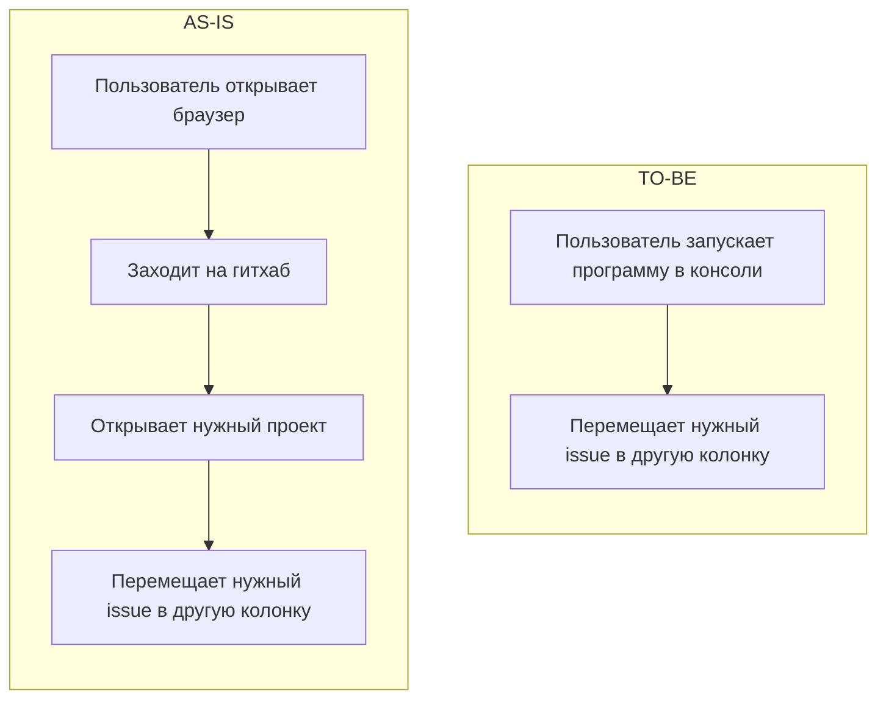

[Ссылка на .docx формат](https://github.com/infgotoinf/gh-pm/raw/refs/heads/main/docs/docx/01.docx)

# Предметная область

Предметная область - IT. Данный проект создаётся как инструмент для организации командной разработки, который интегрируется с Github Projects. Он решает проблему низкой эффективности использования Github Projects и GH cli для работы с проектами. Что достигается посредством предоставления API для работы с Github Projects с TUI интерфейсом и поддержкой клавиатурных сокращений.

# Таблица ролей

| Роль     | Права |
| -------- | ----- |
| Админ    | Может видеть и вносить изменения, а также добавлять новых коллабораторов в проект. |
| Редактор | Может видеть и вносить изменения в проект. |
| Читатель | Может видеть проект. |

# Схемы

# Модель проектирования

| Модель           | Плюсы использования | Минусы использования |
| ---------------- | ------------------- | -------------------- |
| ООП              | Удобство представления issue и проектов, упрощение востприятия кода | Сложность тестирования |
| Функциональньная | Простота написания и тестирования, предсказуемость | Ухудшение читаемости |
| Смешанная        | Возможность использование каждой модели там, где её будет использовать лучше всего, гибкость | Большая необходимость за тем, чтобы следить за постоянством стиля кода |

Была выбрана смешанная модель по той причине, что она более гибкая и с ней можно несложно писать простой для восприятия код.
