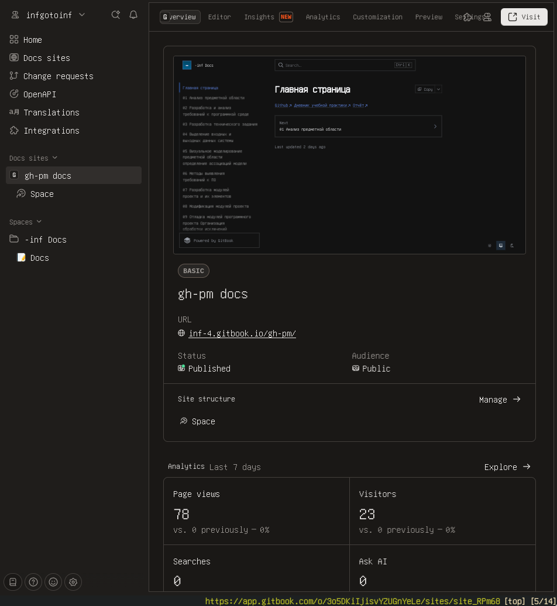
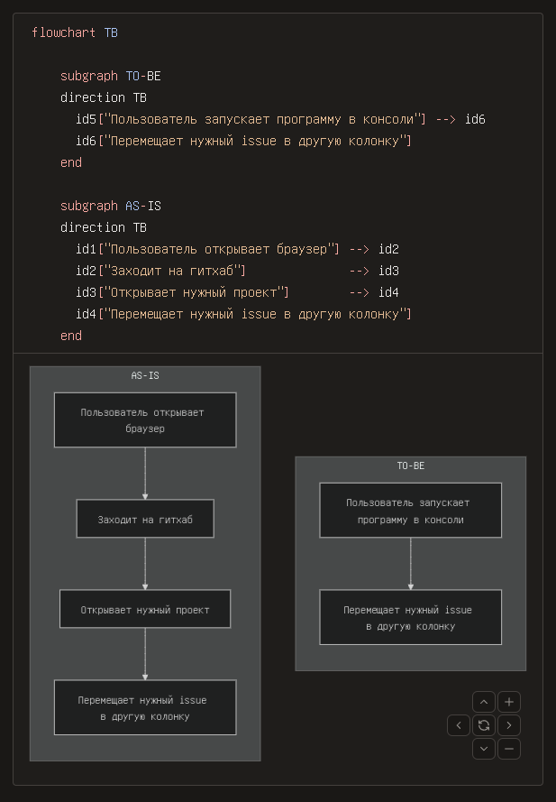
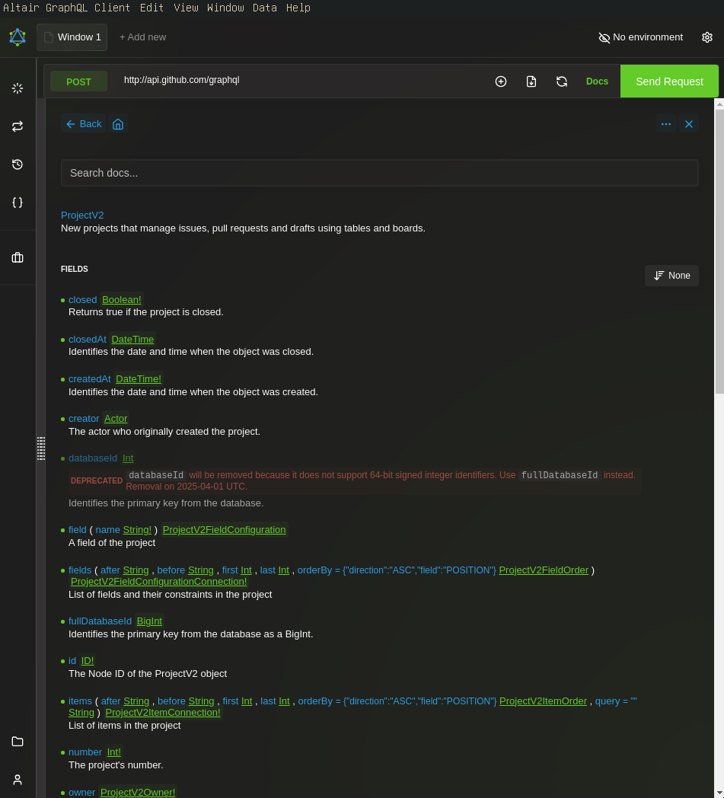
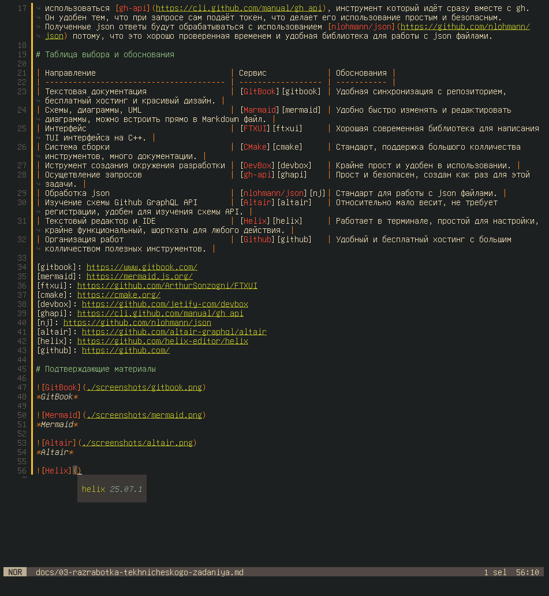
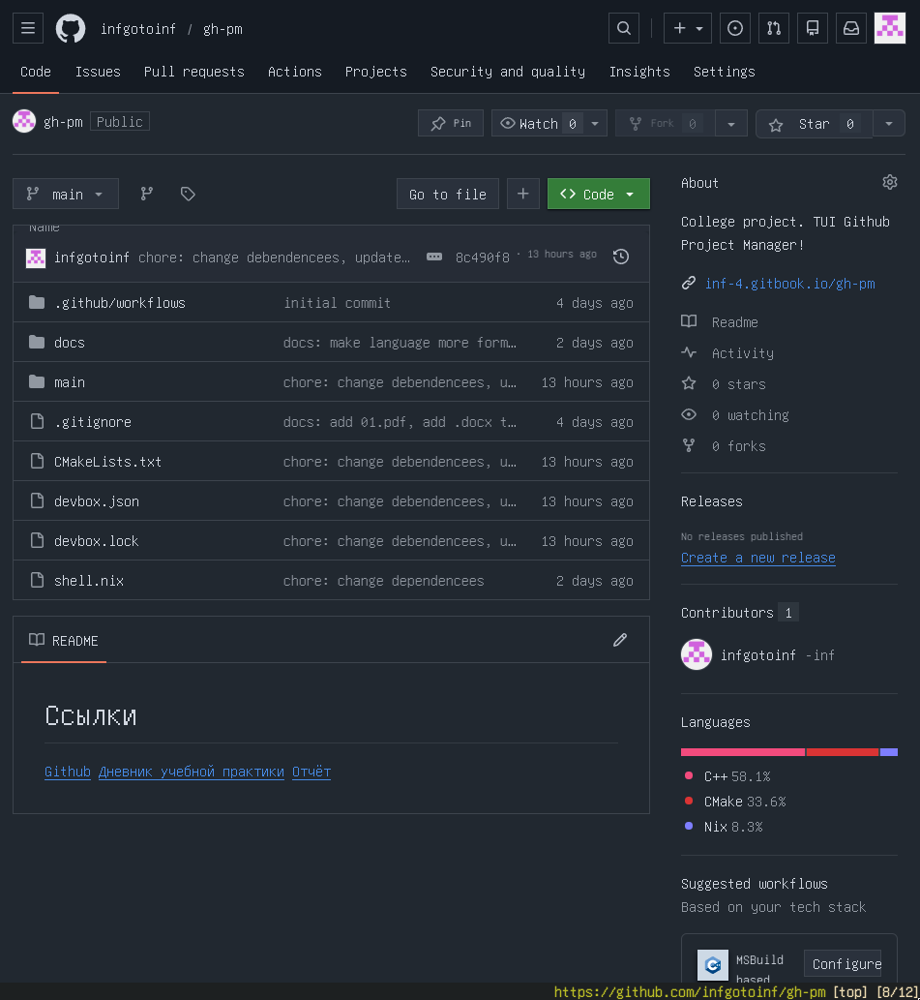

# 03 Разработка технического задания

[Ссылка на .docx формат](https://github.com/infgotoinf/gh-pm/raw/refs/heads/main/docs/docx/03.docx)

## Краткое описание проекта

Данный проект в первую очередь предназначен для разработчиков на Linux, поэтому в первую очередь он должен собираться и запускать на дистрибутивах базированных на Debian, иметь простой и понятный набор шагов для сборки. Документация должна быть легко доступна и читаема. Сам продукт должен работать прямо из терминала и предоставлять TUI интерфейс.

Понадобятся какие-то инструменты для хранения кода, документации, UML диграмм, сборки, создания TUI интерфейса, обращения к Github и обработки полученной от него информации.

## Перечень выбранных иструментов

### Сборка

Для упрощения сбоки и работы с проектом был выбран [Devbox](https://github.com/jetify-com/devbox), он предоставляет возможность написать одно окружение для разработки доступное для всех \*nix систем, благодаря чему колличество шагов сборки заметно уменьшается и становится одинаковым почти для всех платформ. Уже для самой сборки используется [CMake](https://cmake.org/), который является стандартом для C/C++ приложений, благодаря чему его просто использовать с любыми пакетами и инструментами для разработки.

### Документация

Документирование будет производиться в формате Markdown, потому что он распрастранён и является стандартом для ведения технической документации. Для графиков будет использоваться [Marmaid](https://mermaid.js.org/), так как графики на нём очень легко писать, их можно быстро редактировать и исправлять, а также его можно просто встроить в Markdown, чтобы графики отображались прямо в текстовых файлах на таких платформах как Github и GitBook. Для хранения документации была выбран [GitBook](https://www.gitbook.com/) потому, что он позволяет бесплатно хранить документацию, которая синхронизируется с репозиторием, а также предоставляет красивый и удобный вид для просмотра информации.

### Технологии приложения

Приложение будет использовать [FTXUI](https://github.com/ArthurSonzogni/FTXUI), так как это отличное современное решение для написания TUI интерфейсов на С++. Для взаимодействия с Github будет использоваться его GraphQL API потому, что оно куда гибче и удобнее чем REST, а для совершения самих запросов будет использоваться [gh-api](https://cli.github.com/manual/gh_api), инструмент который идёт сразу вместе с gh. Он удобен тем, что при запросе сам подаёт токен, что делает его использование простым и безопасным. Полученные JSON ответы будут обрабатываться с использованием [nlohmann/json](https://github.com/nlohmann/json) потому, что это хорошо проверенная временем и удобная библиотека для работы с JSON файлами.

## Таблица выбора и обоснования

| Направление                             | Сервис                                             | Обоснования                                                                                       |
| --------------------------------------- | -------------------------------------------------- | ------------------------------------------------------------------------------------------------- |
| Текстовая документация                  | [GitBook](https://www.gitbook.com/)                | Удобная синхронизация с репозиторием, бесплатный хостинг и красивый дизайн.                       |
| Схемы, диаграммы, UML                   | [Marmaid](https://mermaid.js.org/)                 | Удобно быстро изменять и редактировать диаграммы, можно встроить прямо в Markdown файл.           |
| Интерфейс                               | [FTXUI](https://github.com/ArthurSonzogni/FTXUI)   | Хорошая современная библиотека для написания TUI интерфейса на C++.                               |
| Система сборки                          | [CMake](https://cmake.org/)                        | Стандарт, поддержка большого колличества инструментов, много документации.                        |
| Иструмент создания окружения разработки | [DevBox](https://github.com/jetify-com/devbox)     | Крайне прост и удобен в использовании.                                                            |
| Осущетвление запросов                   | [gh-api](https://cli.github.com/manual/gh_api)     | Прост и безопасен, создан как раз для этой задачи.                                                |
| Обработка JSON ответов от Gihub         | [nlohmann/json](https://github.com/nlohmann/json)  | Стандарт для работы с JSON файлами.                                                               |
| Изучение схемы Github GraphQL API       | [Altair](https://github.com/altair-graphql/altair) | Относительно мало весит, не требует регистрации, удобен для изучения схемы API.                   |
| Текстовый редактор и IDE                | [Helix](https://github.com/helix-editor/helix)     | Работает в терминале, простой для настройки, крайне функциональный, шорткаты для любого действия. |
| Организация работ                       | [Github](https://github.com/)                      | Удобный и бесплатный хостинг с большим колличеством полезных инструментов.                        |

## Подтверждающие материалы

<figure><figcaption></figcaption></figure>

<em>GitBook</em>

<figure><figcaption></figcaption></figure>

<em>Mermaid</em>

<figure><figcaption></figcaption></figure>

<em>Altair</em>

<figure><figcaption></figcaption></figure>

<em>Helix</em>

<figure><figcaption></figcaption></figure>

<em>Github</em>

## Краткий вывод

Таким образом данная среда позволит быстро и удобно заниматься разработкой приложения и написанием документации.
