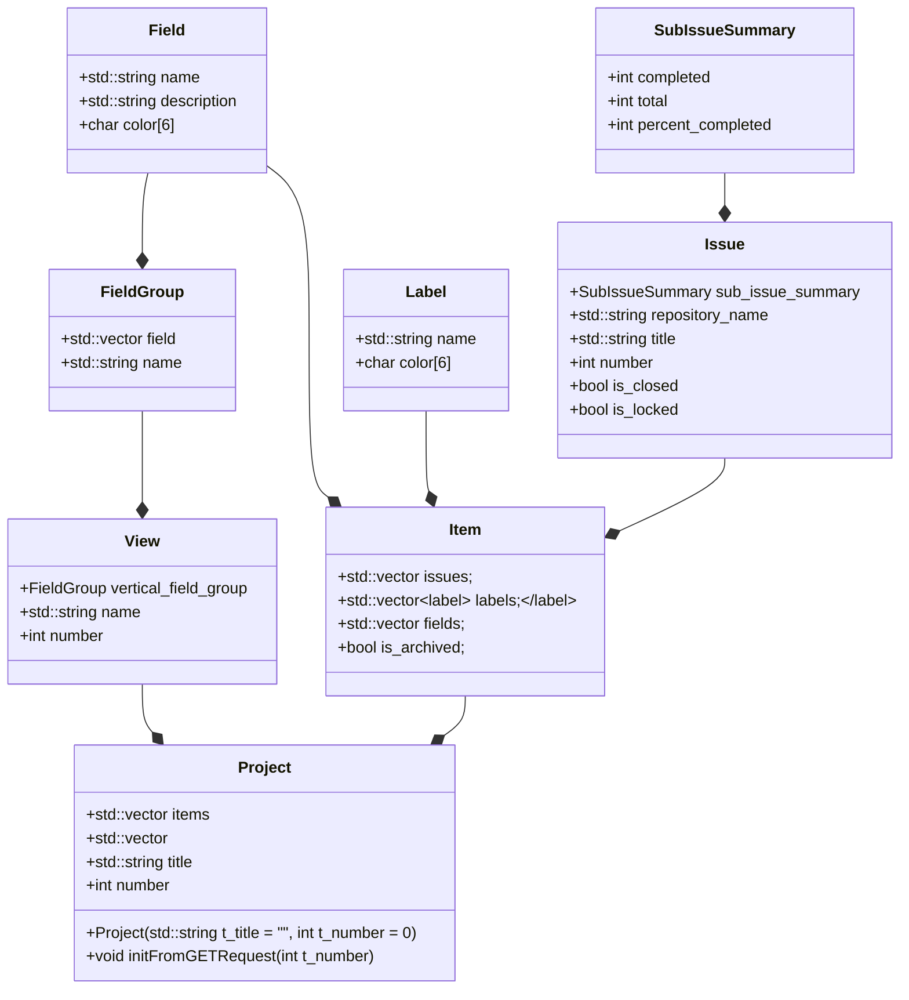

[Ссылка на .docx формат](https://github.com/infgotoinf/gh-pm/raw/refs/heads/main/docs/docx/04.docx)

# Перечень классов и структур предметной области

- Field - представляет из себя поле предмета проекта, нужен для хранения информации о предмете.
- FieldGroup - представляет из себя группу связанных между собой полей предмета, нужен для того, чтобы можно было сортировать по группе полей.
- View - представляет из себя "вид" проекта, которые используются при просмотре проекта, нужен для того, чтобы можно было переключаться между видами проекта.
- SubIssueSummary - нужен для более удобного представления информации о потомках Issue.
- Issue - представляет из себя Github Issue, нужен для того, чтобы пользователь мог взаимодействовать с Issue проекта и получать информацию о них.
- Label - используется для классификации и разбиении по группам Pull Request или Issue.
- Item - представляет из себя полноценный предмет проекта, который отображается в приложении.
- Project - представляет из себя текущий выбранный проект и содержит в себе всю нужную информацию о нём.

# Таблица атрибутов и операций

| Класс           | Назначение                   | Атрибуты                            | Операции |
|-----------------|------------------------------|-------------------------------------|----------|
| Field           | Поле предмета                | name, description, color            | |
| FieldGroup      | Группа полей предмета        | name, field                         | |
| View            | Вид проекта                  | vertical_field_group, name, number  | |
| SubIssueSummary | Информация о потомках Issue  | completed, total, percent_completed | |
| Issue           | Github Issue                 | sub_issue_summary, repository_name, title, number, is_closed, is_locked | |
| Label           | Label Issue или Pull Request | name, color                         | |
| Item            | Предмет проекта              | issues, labels, fields, is_archived | |
| Project         | Текущий выбранный проект     | items, views, title, number         | конструктор, initFromGETrequest |

# Схема классов

# Описание входных и выходных данных

| Тип данных | Наименование            | Источник/Получатель              | Формат                         | Назначение |
|------------|-------------------------|----------------------------------|--------------------------------|-------------|
| Входные    | Github API GET Request  | Пользователь -> Программа -> Github -> Программа -> Пользователь | Нажатие на кнопку -> GH API GraphQL Request -> JSON -> Обновление отображаемых данных в приложении | Запрос на вытягивание данных с Github |
| Выходные   | Github API POST Request | Пользователь -> Программа -> Github -> Программа -> Пользователь | Нажатие на кнопку -> GH API GraphQL Request -> JSON -> Обновление отображаемых данных в приложении | Запрос на изменение данных на Github |
